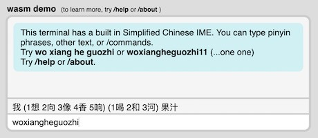

# ime_engine

## Project Status: Archived

See https://github.com/samblenny/hanzi_ime


## Description

ime_engine provides an Input Method Editor back-end (rust) and a
vocabulary data entry workflow (ruby) for a lightweight,
customizable, stand-alone IME. Try the
[WebAssembly demo](https://samblenny.github.io/ime_engine/wasm-demo/).


## Features

### Language Support
- Now: Simplified Chinese with 2500 word HSK5 level vocabulary
- Maybe Later: HSK6, Hangul, Hiragana, Katakana

### Design
- Small and efficient
- Sacrifice ease of typing for better privacy (no AI stuff)
- Builds no_std and does not use heap allocation
- Uses text-based API that does not depend on a graphics toolkit


## Try the WebAssembly Demo



Demo web page with terminal-style UI and WebAssembly (WASM) back-end:
- <https://samblenny.github.io/ime_engine/wasm-demo/>
- code: [wasm-demo/](wasm-demo/)

Things to try typing in demo terminal:
- `/help` + return
- `woxiangheguozhi`
- `woxiang he guozhi` (spaces after g and e)
- `woxiang1he1guozhi` (ones in the middle)
- `woxiangheguozhi11` (ones at the end)
- `woxiang2he2guozhi` (twos instead of ones)


## Try the CLI Demo

To build and run the CLI demo, invoke `cargo run` from repository's root
directory, like this:

```
$ cargo run --quiet

woxiangheguozhi
我 (1想 2向 3像 4香 5响 6项 7象)  (1喝 2和 3河) 果汁

woxiang heguozhi
我想 (1喝 2和 3河) 果汁

woxiang he guozhi
我想喝果汁

woxianheguozhi11
我先喝果汁
```


## For Developers

### Repository Tour

| Directory | Description |
|---|---|
| /src | Rust source; `autogen_hsk.rs` has static arrays with vocab data generated by ruby script |
| /vocab | ruby scripts and TSV text files for vocab data entry |
| /wasm-demo | HTML/CSS/JS source + `webserver.rb` ruby script for local http server |
| /examples/wasm | Rust source for building /wasm-demo/ime_engine.wasm WebAssembly library |


### Install Dev Tools

| Tool | Purpose |
|--|--|
| rustup | Get rustc, cargo, and wasm32-unknown-unknown |
| ruby v2.3+ | Local web server for WebAssembly Demo + Rust code generation from vocab lists |
| GNU make | Augment cargo build with post-build actions (for /examples/wasm) |

Tested July 2020 on macOS Mojave and Debian Stretch.

1. Install rustc with rustup. See <https://www.rust-lang.org/tools/install>
2. Configure PATH environment variable: add `export PATH="$PATH:$HOME/.cargo/bin"`
   to .bash_profile or whatever
3. Add WebAssembly compile target: `rustup target add wasm32-unknown-unknown`
4. Make sure you have a ruby interpreter v2.3 or later: `ruby --version`
   - For macOS Mojave or Catalina, default system ruby should work fine.
   - Debian may need `sudo apt install ruby`


### Run Tests

From repository root directory:

```
cargo test
```


### Build and run WebAssembly demo

1. From repository root directory:
   ```
   cd examples/wasm
   make clean
   make test
   make wasm
   make install
   make webserver
   ```
   Note: `make webserver` is a shortcut for `cd ../../wasm-demo && ruby webserver.rb`
2. Load http://localhost:8000 in browser
3. Stop `webserver.rb` with control-c when done


### Customize Vocab List

1. Read `vocab/autogen-hsk.rb`. There is an array near the top to set which .tsv
   files contain vocab words. Comments describe how the .tsv fields are used.
2. On macOS, BBEdit works well for editing .tsv files. It helps to set 36 pt font
   and 12 character tab width.
3. To re-generate the vocab data static arrays in `src/autogen_hsk.rs`:
   ```
   cd vocab/
   ruby autogen-hsk.rb
   ```
   By default, the script just checks the contents of the .tsv files for duplicates
   and other problems. To update `autogen_hsk.rs`, you must answer `y` at prompt.
